# Java Profiling Tools — offline araç paketi

**[English](README.md) · [Türkçe](README.tr.md)**

Bir Java uygulamasının neden yavaş olduğunu **internet erişimi olmayan** bir
makinede bulmak için gereken her şey. Bütün araçlar bu deponun içinde; hiçbir
şey indirilmiyor, sisteme kurulmuyor ve `$HOME` dışına yazılmıyor.

Merkezde tek bir komut var:

```bash
./scripts/diagnose.sh <pid>
```

Çalışan bir JVM'e bağlanıyor, toplanmaya değer ne varsa topluyor ve size neyin
pahalıya patladığını **gerçek sınıf ve metot adıyla**, neden pahalı olduğunu ve
ne yapmanız gerektiğini söyleyen bir rapor basıyor.

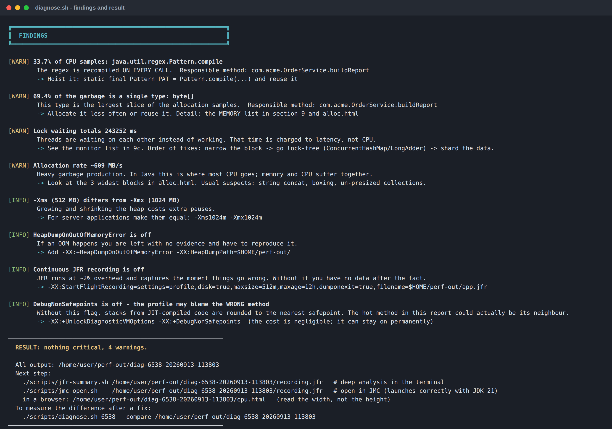

> Bu README'deki her sayı ve her ekran görüntüsü, gerçek bir JVM üzerinde
> yapılmış gerçek bir çalıştırmadan geliyor. Hiçbiri temsili değil. Görsellerin
> nasıl üretildiği için [`docs/`](docs/README.tr.md) klasörüne bakın.

---

## İçindekiler

- [Bu paket neden var](#bu-paket-neden-var)
- [Gereksinimler](#gereksinimler)
- [Kurulum (5 dakika)](#kurulum-5-dakika)
- [60 saniyelik akış](#60-saniyelik-akış)
- [`diagnose.sh` ne veriyor](#diagnosesh-ne-veriyor)
- [Düzeltme işe yaradı mı? `--compare`](#düzeltme-işe-yaradı-mı---compare)
- [JMH ile kanıtlamak](#jmh-ile-kanıtlamak)
- [GUI araçları](#gui-araçları)
  - [JMC neden açılmıyordu, nasıl çözüldü](#jmc-neden-açılmıyordu-nasıl-çözüldü)
  - [VisualVM, eklentileri kurulu halde](#visualvm-eklentileri-kurulu-halde)
- [Script referansı](#script-referansı)
- [Araç referansı](#araç-referansı)
- [Çıktıyı okumak](#çıktıyı-okumak)
- [Parçalı arşivler](#parçalı-arşivler)
- [Yazma kısıtı: sadece `$HOME`](#yazma-kısıtı-sadece-home)
- [Depo yapısı](#depo-yapısı)
- [Sorun giderme](#sorun-giderme)
- [İndirilenleri doğrulamak](#i̇ndirilenleri-doğrulamak)
- [Lisans](#lisans)

---

## Bu paket neden var

İnternete kapalı ya da sıkı güvenlik duvarı arkasındaki bir makinede
"uygulama yavaş" sorusunun normal cevabı — profiler kur, tarayıcı aç, eklenti
indir — mümkün değil. Bu depo bütün zinciri offline çalışacak şekilde
paketliyor:

| Offline makinedeki sorun | Bu deponun çözümü |
|---|---|
| Kurulu profiler yok, `dnf install` edilecek bir şey de yok | async-profiler, JFR, JMC, VisualVM, MAT paketin içinde |
| JDK 11'li sistemde JMC açılmıyor | Bir wrapper, paketteki JDK 21'i Eclipse'e açıkça veriyor |
| VisualVM Visual GC, MBeans, Tracer… olmadan geliyor | 21 eklenti modülü pakette, offline kuruluyor |
| GitHub 200 MB'lık dosyayı kabul etmiyor | Büyük arşivler parçalanmış, birleştirici de pakette |
| `/opt`'a yazmak için root gerekiyor | Her şey `tools/` içine açılıyor, çıktı `$HOME`'a gidiyor |
| Flame graph için tarayıcı gerekiyor, o da yok | `diagnose.sh` aynı sonuçları metin olarak basıyor |

---

## Gereksinimler

- Linux x86-64 (RHEL 9 üzerinde geliştirildi ve test edildi; RHEL'e özel bir
  bağımlılık yok)
- `bash`, `tar` ve şunlardan biri: `unzip` / `python3` / `jar` / `bsdtar`
- Ölçeceğiniz uygulama için makinede bir JDK — **8 ve üzeri herhangi bir sürüm**.
  Paketteki JDK 21 sadece araçları *çalıştırmak* için kullanılıyor.
- **Root gerekmiyor.** Ne kurulum için ne de profil almak için.
- Bir JVM'e bağlanmak için **onu çalıştıran kullanıcı olmanız** gerekir
  (ya da root).

---

## Kurulum (5 dakika)

```bash
git clone <bu-depo> ~/java-profiling-tools
cd ~/java-profiling-tools
./scripts/00-setup.sh
```

Bu tek script bütün arşivleri `tools/` içine açıyor, parçalı olanları
birleştiriyor, JMC ve MAT'ı paketteki JDK 21'e sabitliyor, MAT'ın heap'ini
makine RAM'inin yarısına çıkarıyor, 21 VisualVM eklentisini kuruyor ve bir
doğrulama tablosuyla bitiyor:

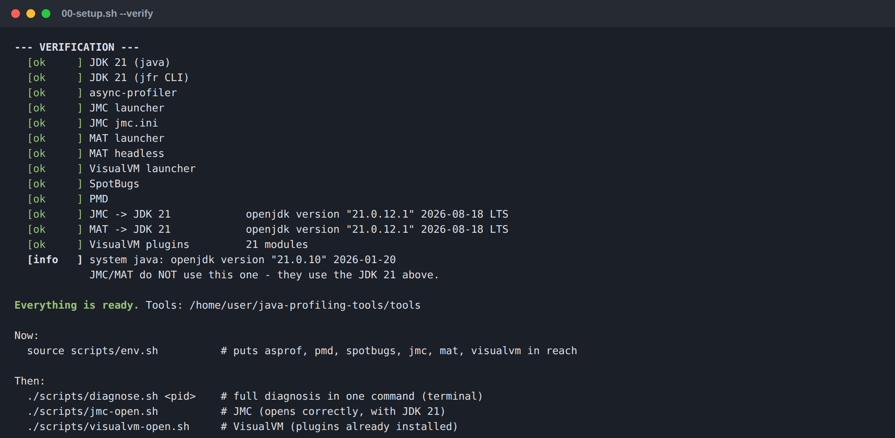

Kontrolü istediğiniz zaman `./scripts/00-setup.sh --verify` ile tekrarlayın.

Sonra, her kabukta bir kez:

```bash
source scripts/env.sh
```

Bu komut `PROFILING_HOME`, `TOOLS` ve `PERF_OUT` değişkenlerini export ediyor,
`asprof`, `pmd` ve `spotbugs`'ı `PATH`'e ekliyor ve `diagnose`, `jmc`,
`visualvm`, `mat` kısayollarını tanımlıyor.

---

## 60 saniyelik akış

```bash
# 1. Hangi JVM'ler çalışıyor?
./scripts/diagnose.sh --list

# 2. Birini teşhis et, sıcak noktaları KENDİ paketinle eşleştir
./scripts/diagnose.sh 12345 --package com.acme

# 3. En üstteki bulguyu düzelt, sonra işe yaradığını kanıtla
./scripts/diagnose.sh 12345 --compare ~/perf-out/diag-12345-20260913-113803
```

Bütün döngü bu: **ölç → tek bir şeyi düzelt → tekrar ölç**. Sayı kıpırdamadıysa
değişikliği geri alın.

---

## `diagnose.sh` ne veriyor

Tek komut on bir bölüm üretiyor. Bilerek yavaş yazılmış bir sipariş servisine
karşı yapılmış gerçek bir çalıştırma şöyle görünüyor.

### 1–3. bölüm — kimlik, işletim sistemi, bellek

Process kim, hangi JVM ve GC, bütün başlatma flag'leri, RSS'e karşı heap tavanı,
thread ve dosya tanımlayıcı sayıları, container (cgroup) limitleri ve
throttling, heap kırılımı.

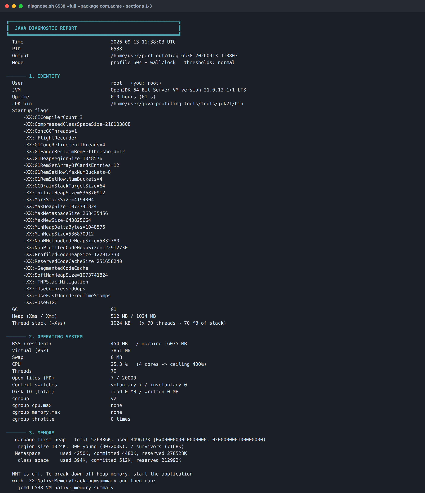

### 4–7. bölüm — GC, thread'ler, thread başına CPU, JIT

GC yükünün gerçek zamana oranı, allocation ve terfi hızları, thread durum
dağılımı, üç dump'ın hepsinde aynı metotta duran thread'ler, en çok CPU yiyen
thread'ler **ve her birinin o an hangi metotta olduğu**, code cache ve sınıf
yükleme sayıları.

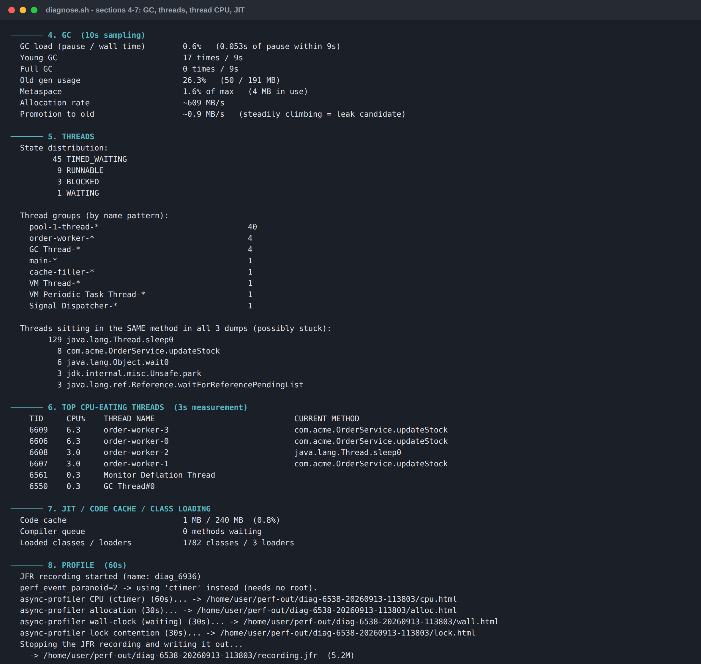

### 9. bölüm — sıcak kod noktaları, sebep ve çözümüyle

Raporu okumaya değer kılan kısım burası. Her sıcak frame için frame'in kendisini,
altındaki **sizin paketinizdeki** ilk metodu, yaklaşık 50 Java anti-pattern'inden
oluşan bir sözlükten gelen olası sebebi ve somut bir çözümü basıyor.

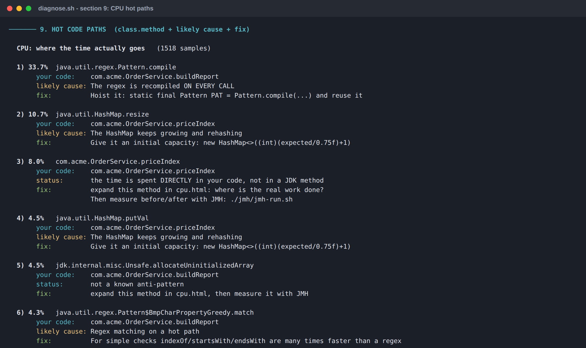

Aynı muamele allocation için de geçerli — çöp hangi tipten, kim tahsis ediyor ve
ne yapmalı:

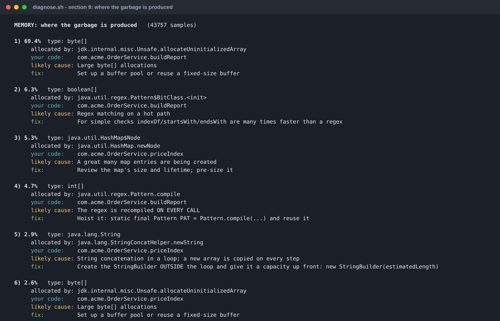

Kilitler ve safepoint'ler için de — olay **sayısına** göre değil, **kaybedilen
zamana** göre sıralanmış halde:

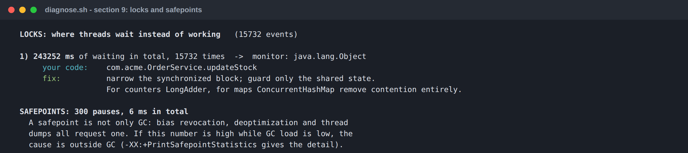

### Bulgular

Yukarıdaki her şey sonra sıralı bir listeye indirgeniyor. Her bulgu neyin yanlış
olduğunu, neden önemli olduğunu ve tam olarak neyi değiştirmeniz gerektiğini
söylüyor:


Çıkış kodu cron veya CI içinde kullanılabilir: `0` temiz, `1` uyarı, `2` kritik,
`3` çalıştırılamadı. `--json` ekleyince ayrıca makine tarafından okunabilir bir
`summary.json` da yazılıyor.

### Flame graph

async-profiler varsa (kurulumdan sonra var) gerçek flame graph'lar da
alıyorsunuz. **Genişliğe** bakın, yüksekliğe değil:

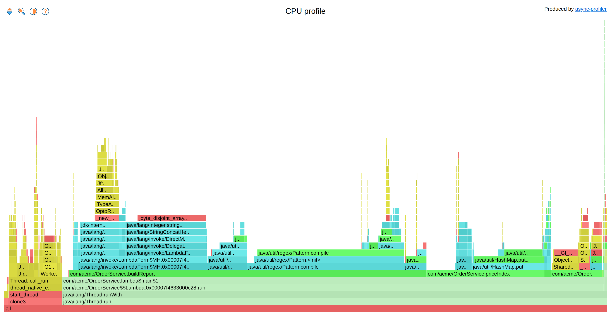

`com/acme/OrderService.buildReport` altındaki `java/util/regex/Pattern.compile`
en geniş blok — regex her turda yeniden derleniyor.

### Seçenekler

| Seçenek | Ne yapar |
|---|---|
| `--quick` | Profil yok; sadece anlık metrikler (~20 s) |
| `--full` | Ayrıca wall-clock ve kilit profili (thread'ler nerede **bekliyor**) |
| `--duration N` | Profil süresi, saniye (varsayılan 60) |
| `--deep` | Ayrıca heap dump + MAT headless (ağır, STW duraklama) |
| `--package com.acme` | Sıcak noktaları kendi kodunuzla eşleştirin |
| `--output DIZIN` | Çıktı dizini (varsayılan `$PERF_OUT/diag-<pid>-<zaman>`) |
| `--threshold strict\|normal\|loose` | Bulguların ne kadar hassas olacağı (varsayılan `normal`) |
| `--compare DIZIN` | Önceki bir ölçümle karşılaştır |
| `--json` | Ayrıca `summary.json` yaz |
| `--no-color` | ANSI renk kodu basma |
| `--list` | Çalışan Java process'lerini listele ve çık |

---

## Düzeltme işe yaradı mı? `--compare`

Ölç, düzelt, tekrar ölç. `--compare` önceki çalıştırmanın çıktı dizinini alıyor
ve farkları basıyor; her birini doğru yöne mi gittiğine göre renklendiriyor.

Aşağıda aynı servis, profilin işaret ettiği dört düzeltmeden sonra — regex
yukarı taşındı, tarih formatter'ı yeniden kullanılır oldu, map ön-boyutlandırıldı
ve `synchronized` blok daraltıldı:

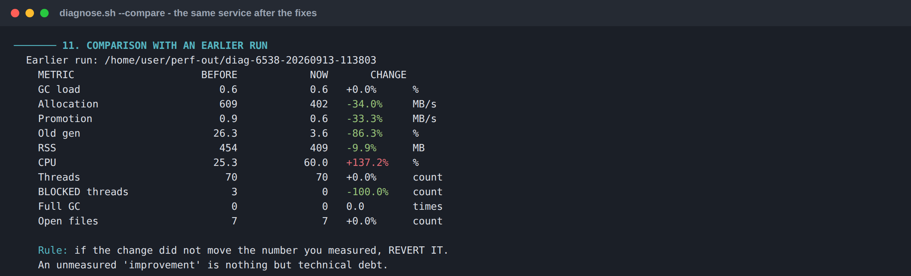

Allocation %34, old gen'e terfi %33, old gen doluluğu %86 düştü; BLOCKED
thread'ler tamamen bitti. CPU ise %137 **arttı** — ki doğru sonuç bu: kilit
çekişmesi ortadan kalkınca aynı thread'ler artık birbirini beklemek yerine iş
yapıyor.

> **Kural:** bir değişiklik, hareket ettirmeye çalıştığınız sayıyı hareket
> ettirmediyse geri alın. Ölçülmemiş "iyileştirme" sadece teknik borçtur.

---

## JMH ile kanıtlamak

Profil size zamanın nereye gittiğini söyler. Düzeltmenizin gerçekten hızlandırıp
hızlandırmadığını ise **benchmark** söyler. JMH pakette ve Maven olmadan
çalışıyor:

```bash
./jmh/jmh-run.sh jmh/example/SpeedBenchmark.java
```

Örnek benchmark, döngüde string concat ile ön-boyutlandırılmış bir
`StringBuilder`'ı karşılaştırıyor — en yaygın Java performans hatası:

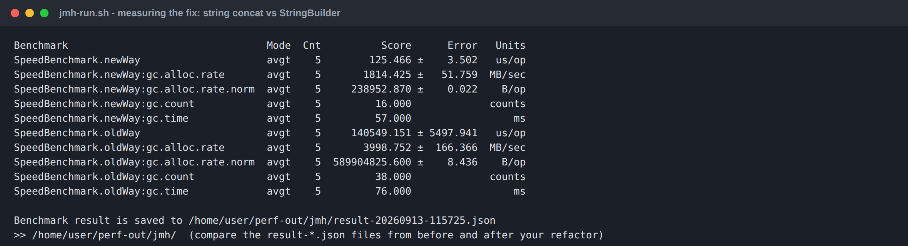

140.549 µs/op'a karşı 125 µs/op ve işlem başına 590 MB'a karşı 239 KB tahsis.
Yani tek bir değişiklikle **1.120× hızlı**, **2.470× daha az çöp**.

`-prof gc` varsayılan olarak açık, çünkü `gc.alloc.rate.norm` (işlem başına
tahsis edilen bayt) genellikle süreden daha çok şey anlatır.

Kendi kodunuzu ölçmek için script'i kendi sınıflarınıza yöneltin:

```bash
./jmh/jmh-run.sh MyBenchmark.java $HOME/myapp/lib/app.jar -f 1 -wi 5 -i 10
```

> Benchmark sınıfı **bir paket bildirmek zorunda** — JMH varsayılan paketi
> reddediyor. Ayrıca sonucu mutlaka bir `Blackhole` ile tüketin, yoksa JIT
> ölçmeye çalıştığınız döngüyü tamamen siler.

---

## GUI araçları

### JMC neden açılmıyordu, nasıl çözüldü

JDK Mission Control bir Eclipse RCP uygulaması ve **Java 17+** istiyor. Sistem
JDK'sı 11 olan bir makinede launcher'ı doğrudan çalıştırınca şu hatayı veriyor:

```
Version 11.0.x of the JVM is not suitable for this product.
Version: 17 or greater is required.
```

Eclipse launcher'ı hangi JVM'i kullanacağına `jmc.ini` içindeki `-vm` satırına
bakarak karar veriyor. O satır yoksa `PATH`'teki `java`'ya düşüyor — yani JDK
11'e. Bunu iki şey çözüyor ve bu depo ikisini de yapıyor:

1. `00-setup.sh`, `jmc.ini` (ve `MemoryAnalyzer.ini`) içine paketteki JDK 21'i
   gösteren bir `-vm` bloğu yazıyor. Blok **mutlaka** `-vmargs` satırının
   üstünde olmalı ve yol kendi satırında durmalı; yoksa Eclipse yok sayıyor.
2. `scripts/jmc-open.sh` ayrıca **komut satırında** `-vm <paketteki-java>`
   geçiriyor; bu ini dosyasını eziyor. Paket başka bir yere taşınsa veya ini bir
   güncellemeyle üzerine yazılsa bile çalışmaya devam ediyor.

Her iki durumda da JDK 21'de çalışan sadece *JMC'nin kendisi*. Analiz ettiğiniz
uygulama kendi JDK'sında kalıyor ve JMC, JDK 8/11/17 kayıtlarını sorunsuz
okuyor.

```bash
./scripts/jmc-open.sh                                   # sadece JMC'yi aç
./scripts/jmc-open.sh ~/perf-out/diag-*/recording.jfr   # kayıtla birlikte aç
./scripts/jmc-open.sh --where                           # seçimleri yaz, hiçbir şey açma
```

İşte JDK 21 üzerinde çalışırken, kayıt yüklenmiş ve kural motoru bitmiş halde —
Automated Analysis Results, `diagnose.sh`'ın ölçtüğü aynı JVM hakkında JMC'nin
kendi kararı:

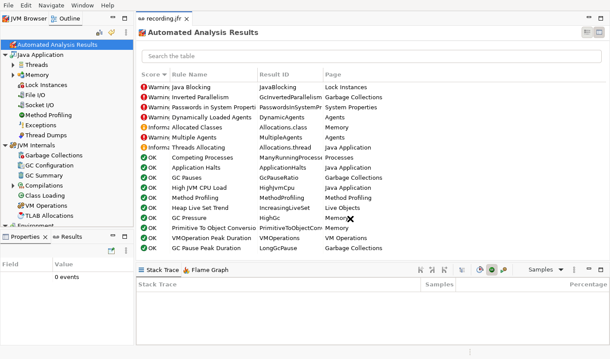

### VisualVM, eklentileri kurulu halde

VisualVM; Visual GC, MBeans, Buffer Monitor, Threads Inspector, Startup
Profiler, Tracer ve BTrace ile **gelmiyor**. Her biri ayrı bir eklenti ve
normalde *Tools → Plugins* üzerinden indiriliyor — yani internet gerekiyor.

Bu yüzden 21 `.nbm` modülünün hepsi [`plugins/visualvm/`](plugins/visualvm/)
içinde duruyor. `00-setup.sh` her birinin içindeki `netbeans/` ağacını ayrı bir
**cluster** dizinine açıyor, `visualvm-open.sh` de bu cluster'ı
`visualvm_extraclusters` üzerinden VisualVM'e veriyor. Böylece eklentiler **ilk
açılışta** etkin geliyor — sihirbaz yok, yeniden başlatma yok, internet yok.

```bash
./scripts/visualvm-open.sh                       # VisualVM'i aç
./scripts/visualvm-open.sh ~/perf-out/heap.hprof # heap dump yüklü olarak aç
./scripts/visualvm-open.sh --jdk21               # paketteki JDK 21 ile çalıştır
./scripts/visualvm-open.sh --clean               # userdir'i sıfırla
```

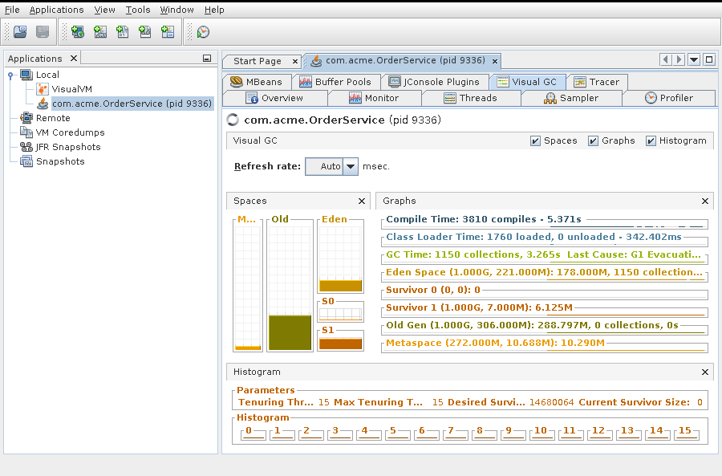

`MBeans`, `Buffer Pools`, `JConsole Plugins`, `Visual GC` ve `Tracer` sekme
sırasında duruyor, Visual GC de canlı eden/survivor/old verisi çiziyor.

> Bu 21 modülden biri sırf diğerleri yüklensin diye var:
> `org-openjdk-btrace-visualvm-tracer-deployer`. Tracer probe modülleri
> `OpenIDE-Module-Requires` ile BTrace deployer yeteneğine bağımlılık bildiriyor;
> o olmadan VisualVM açılışta *"could not install some modules"* diyerek
> takılıyor.

JMC'nin aksine VisualVM varsayılan olarak **sistem** JDK'sında çalışıyor, ve bu
bilinçli: Sampler ve Profiler hedef JVM'e bir agent yüklüyor, uygulamanın Java
sürümüyle aynı olmak en güvenli seçim. Değiştirmek için `--jdk21` kullanın.

| Eklenti | Nerede çıkıyor | Ne işe yarıyor |
|---|---|---|
| Visual GC | *Visual GC* sekmesi | Eden/survivor/old'u canlı izlemek; tenuring dağılımı |
| Buffer Monitor | *Buffer Pools* sekmesi | **RSS ≫ heap ise ÖNCE buraya bakın** — direct ve mapped `ByteBuffer` |
| MBeans | *MBeans* sekmesi | JMX üzerinden ayar okumak ve değiştirmek |
| Threads Inspector | *Threads* sekmesi | Seçili thread'in o anki stack'i |
| Tracer | *Tracer* sekmesi | JVM / IO / koleksiyon probe'ları, zaman serisi olarak |
| BTrace | Sağ tık → *Trace application…* | Canlı JVM'de dinamik tracing |
| Startup Profiler | *Applications* → sağ tık | Açılış maliyetini ölçmek |
| OQL syntax | Heap dump → *OQL Console* | Dump sorgularken renklendirme ve tamamlama |
| JConsole Plugins | *JConsole Plugins* sekmesi | Mevcut JConsole eklentilerini kullanmak |

### MAT (Memory Analyzer)

MAT da JMC gibi JDK 21'e sabitleniyor ve `-Xmx` değeri kurulumda makine RAM'inin
yarısına çıkarılıyor (en az 2 GB, en fazla 8 GB) — gelen 1 GB küçük bir dump'ı
bile açmaya yetmiyor.

```bash
mat &                                         # GUI (ekran gerekir)
./scripts/heap-summary.sh <pid> --dump        # ya da headless: dump + Leak Suspects
```

**Kural:** MAT'ın `-Xmx` değeri dump boyutunun en az yarısı olmalı. 8 GB'lık bir
dump mu açacaksınız? `tools/mat/MemoryAnalyzer.ini` içindeki satırı elle
yükseltin.

### Ekran yoksa

Gerek de yok. `diagnose.sh` ve `jfr-summary.sh` aynı sonuçları metin olarak
basıyor, `heap-summary.sh` MAT'ı headless çalıştırıyor. GUI'yi gerçekten
istiyorsanız ya `ssh -X` kullanın ya da `.jfr` / `.hprof` dosyasını kendi
makinenize kopyalayın.

---

## Script referansı

Her script kendi kendini belgeliyor: `-h` ile aynı metni görürsünüz.

### `scripts/00-setup.sh` — paketi aç

Bütün arşivleri `tools/` içine açıyor, parçalı olanları birleştiriyor, JMC/MAT'ı
paketteki JDK 21'e sabitliyor, MAT'ın heap'ini yükseltiyor, VisualVM
eklentilerini kuruyor, doğruluyor.

| Seçenek | Anlamı |
|---|---|
| *(yok)* | Eksik olanları aç, GUI araçlarını yapılandır |
| `--reset` | `tools/` dizinini sil ve sıfırdan aç |
| `--no-plugins` | VisualVM eklentilerini kurma |
| `--verify` | Hiçbir şey açma; sadece mevcut kurulumu kontrol et |

Tekrar çalıştırmak güvenli: zaten açılmış olanlar atlanıyor.

### `scripts/env.sh` — ortam değişkenleri ve kısayollar

`source` edin. `PROFILING_HOME`, `TOOLS`, `PERF_OUT`, `ASPROF`, `JFRCLI`,
`JAVA21`, `JOL`, `GCVIEWER`, `JFRCONV` değişkenlerini export ediyor; `pmd`,
`spotbugs` ve `asprof`'u `PATH`'e ekliyor; `diagnose`, `jmc`, `mat`, `visualvm`
kısayollarını tanımlıyor.

### `scripts/diagnose.sh` — tek komutta tam teşhis

Paketin ana komutu. Seçenek tablosu için
[`diagnose.sh` ne veriyor](#diagnosesh-ne-veriyor) bölümüne bakın.

```bash
./scripts/diagnose.sh --list                          # hangi JVM'ler çalışıyor
./scripts/diagnose.sh 12345                           # tam teşhis, ~90 s
./scripts/diagnose.sh 12345 --quick                   # sadece metrikler, ~20 s
./scripts/diagnose.sh myapp --full --package com.acme # isimle, + bekleme/kilit analizi
./scripts/diagnose.sh 12345 --deep                    # + heap dump + MAT headless
```

**Pid veya process adı** kabul ediyor. İsimle eşleştirirken her adayın gerçekten
bir JVM olduğunu doğruluyor; bu yüzden kendi kabuğunuzu veya bir
`tail | grep`'i yakalamıyor.

Ctrl-C ile kesmek güvenli: çıkmadan önce hedefte başlattığı JFR kaydını
durduruyor ve async-profiler'ı ayırıyor.

### `scripts/jmc-open.sh` — JMC'yi doğru JDK ile aç

| Seçenek | Anlamı |
|---|---|
| `<dosya.jfr>` | O kayıt yüklü olarak aç |
| `--jdk YOL` | Paketteki yerine belirli bir JDK kullan |
| `--memory 4g` | JMC'nin kendi heap'i (büyük kayıtlar için gerekir) |
| `--clean` | JMC workspace'ini sıfırla |
| `--foreground` | Terminalden ayrılma |
| `--where` | Hangi JDK/workspace kullanılacağını yaz, hiçbir şey açma |

### `scripts/visualvm-open.sh` — VisualVM'i eklentileriyle aç

| Seçenek | Anlamı |
|---|---|
| `<dosya.hprof\|dosya.jfr>` | O dump veya kayıt yüklü olarak aç |
| `--jdk21` | VisualVM'i paketteki JDK 21 ile çalıştır |
| `--jdk YOL` | Belirli bir JDK ile çalıştır |
| `--clean` | Userdir'i sıfırla (ayarlar bozulduysa) |
| `--no-plugins` | Eklenti cluster'ını bağlamadan aç |
| `--accept-license` | İlk açılıştaki lisans sorusunu önceden kabul et |
| `--foreground` | Terminalden ayrılma |
| `--where` | Seçimleri yaz, hiçbir şey açma |

### `scripts/heap-summary.sh` — GUI'siz bellek analizi

```bash
./scripts/heap-summary.sh <pid>           # RSS vs heap, thread sayısı, sınıf histogramı
./scripts/heap-summary.sh <pid> --dump    # + heap dump + MAT headless Leak Suspects
./scripts/heap-summary.sh dump.hprof      # var olan bir dump'ı headless analiz et
```

Önce asıl önemli ayrımı yapıyor: **sorun gerçekten heap'te mi?** RSS ≫ heap ise
`-Xmx`'i düşürmek işe yaramaz ve script bunun yerine neye bakmanız gerektiğini
söylüyor.

### `scripts/jfr-record.sh` — çalışan process'ten JFR kaydı

```bash
./scripts/jfr-record.sh <pid>                  # settings=profile ile 180 s
./scripts/jfr-record.sh <pid> --duration 600
```

### `scripts/jfr-summary.sh` — kaydı terminalde çöz

```bash
./scripts/jfr-summary.sh recording.jfr [satır]
```

Olay sayıları, self time'a göre en sıcak metotlar, en çok tahsis edilen tipler,
onları tahsis eden kod, sebebiyle birlikte en uzun GC duraklamaları ve en çok
çekişilen monitörler. GUI gerekmiyor.

### `scripts/cpu-profile.sh` / `scripts/memory-profile.sh` — flame graph

```bash
./scripts/cpu-profile.sh <pid> 60
./scripts/memory-profile.sh <pid> --duration 60 --heap-dump
```

İkisi de süreyi hem konum olarak hem de `--duration N` şeklinde kabul ediyor ve
sayı olmayan bir değeri sessizce sıfır saniye profil almak yerine reddediyor.
`perf_event_paranoid > 1` olduğunda `cpu-profile.sh` otomatik olarak `cpu`'dan
`ctimer`'a düşüyor; böylece hiçbir ayrıcalık gerekmiyor.

### `scripts/static-scan.sh` — kodu çalıştırmadan analiz

```bash
./scripts/static-scan.sh build/classes src/main/java
```

Bytecode üzerinde SpotBugs (PERFORMANCE, CORRECTNESS, MT_CORRECTNESS), kaynak
üzerinde PMD (performance + design), ayrıca kopyala-yapıştır tespiti. Ek kural
paketlerini (`sb-contrib`, `findsecbugs`) `spotbugs-rule-packs/` içine atarsanız
otomatik yükleniyor.

Bunlar **aday** bulur, kanıt değil. Bir şeyi değiştirmeden önce profille
doğrulayın.

### `scripts/zip-join.py` — parçalı arşiv birleştirici

```bash
python3 scripts/zip-join.py buyuk.zip birlesik.zip
```

`00-setup.sh` tarafından otomatik çağrılıyor.
[Parçalı arşivler](#parçalı-arşivler) bölümüne bakın.

### `scripts/common.sh` — paylaşılan yardımcılar

Diğer script'ler tarafından `source` ediliyor, doğrudan çalıştırılmıyor: belirli
bir sürümden yüksek JDK bulmak, Java sürümü okumak, pid veya process adını
gerçek bir JVM'e çözmek, süre doğrulamak, tutarlı mesajlar basmak.

### `jmh/jmh-run.sh` — Maven'sız JMH

```bash
./jmh/jmh-run.sh <Benchmark.java> [ek-classpath] [jmh-argümanları...]
```

JMH annotation processor'ıyla derliyor ve çalıştırıyor, `-prof gc` açık, JSON
sonuç `$PERF_OUT/jmh/result-<zaman>.json` dosyasına yazılıyor.

---

## Araç referansı

| Araç | Sürüm | Ne için |
|---|---|---|
| **JDK 21** (Temurin) | 21.0.12.1 | JMC ve MAT'ı çalıştırır; `jfr` CLI'yi sağlar. Uygulamanız için değil. |
| **async-profiler** | 4.5 | Düşük maliyetli CPU / alloc / lock / wall profili, safepoint bias'ı yok |
| **JFR** | JDK'nın içinde | Sürekli açık kalabilen uçuş kaydedici, ~%2 maliyet |
| **JMC** | 9.1.2 | JFR kayıtları için GUI, otomatik kural motoruyla |
| **VisualVM** | 2.2.1 | Canlı izleme, sampling, heap dump (+21 eklenti) |
| **MAT** | 1.17.0 | Heap dump analizi, Leak Suspects, dominator tree |
| **jfr-converter** | pakette | async-profiler olmadan JFR kaydını flame graph'a çevirir |
| **GCViewer** | 1.37 | GC loglarını görselleştirir |
| **SpotBugs** | 4.10.4 | Bytecode analizi (performans + doğruluk) |
| **PMD / CPD** | 7.27.0 | Kaynak analizi ve kopyala-yapıştır tespiti |
| **JaCoCo** | 0.8.15 | Kapsam — hangi kodun gerçekten çalıştığını bilmek için |
| **JMH** | 1.37 | JIT oyunlarına dayanan mikrobenchmark'lar |
| **JOL** | 0.17 | Nesne bellek düzeni, bayt bayt |

### JFR, tek blokta

Üretimde açın ve açık bırakın. ~%2'ye mal olur ve bir şey ters gittiğinde
elinizde veri olmasıyla olmaması arasındaki farktır:

```
-XX:StartFlightRecording=settings=profile,disk=true,maxsize=512m,maxage=12h,dumponexit=true,filename=$HOME/perf-out/app.jfr
-XX:+UnlockDiagnosticVMOptions -XX:+DebugNonSafepoints
```

`DebugNonSafepoints` göründüğünden önemlidir: o olmadan JIT'lenmiş kodun
stack'leri en yakın safepoint'e yuvarlanır, yani profiler **yanlış metodu**
suçlayabilir — genelde gerçek suçlunun komşusunu.

Onsuz başlatılmış bir process'te anlık olarak:

```bash
jcmd <pid> JFR.start name=rec settings=profile
jcmd <pid> JFR.check
jcmd <pid> JFR.stop name=rec filename=$HOME/perf-out/rec.jfr
```

### async-profiler, tek blokta

```bash
asprof -d 60 -e cpu   -o flamegraph -f cpu.html   <pid>   # CPU nereye gidiyor
asprof -d 60 -e alloc -o flamegraph -f alloc.html <pid>   # çöpü kim üretiyor
asprof -d 60 -e wall  -o flamegraph -f wall.html  <pid>   # thread'ler nerede BEKLİYOR
asprof -d 60 -e lock  -o flamegraph -f lock.html  <pid>   # kilit çekişmesi
```

- `-e cpu` için `perf_event_paranoid <= 1` gerekir. Daha yüksekse `-e ctimer`
  kullanın; hiçbir ayrıcalık istemiyor.
- **`asprof` process'ini öldürmek agent'ı ayırmaz.** Bir oturum takıldıysa onu
  bitiren komut `asprof stop <pid>`. (`diagnose.sh` bunu Ctrl-C dahil sizin için
  hallediyor.)
- `-e wall` herkesin unuttuğu seçenek ve "CPU düşük ama uygulama yavaş"ın
  cevabı o.

---

## Çıktıyı okumak

Çok emek kurtaran birkaç kural.

**Flame graph genişlikten okunur, yükseklikten değil.** Yükseklik sadece stack
derinliğidir. Zaman en geniş blokta geçiyor. Oradan başlayın, sadece oradan.

**RSS ≫ heap ise sorun heap'te değildir.** `-Xmx`'i düşürmek işe yaramaz.
Sırayla şunlara bakın:

1. `export MALLOC_ARENA_MAX=2` — glibc her thread grubu için ayrı bir malloc
   arena açar; çok thread'li bir uygulamada tek başına bu bile yüzlerce MB
   kazandırır, özellikle RHEL'de.
2. thread sayısı × `-Xss` — 2.000 thread × 1 MB, 2 GB stack demektir.
3. Metaspace ve direct `ByteBuffer`'lar — `-XX:NativeMemoryTracking=summary` ile
   başlayın, sonra `jcmd <pid> VM.native_memory summary`. VisualVM'de
   *Buffer Pools* sekmesi direct buffer'ları canlı gösterir.

**GC yükü bir orandır, sayı değil.** 10 saniyede 200 young GC, toplamı 40 ms ise
sorun değildir. Bir tane Full GC ise sorundur. `diagnose.sh` duraklama süresini
gerçek zamana oran olarak raporlar; önemli olan sayı budur.

**Terfi hızı, sızıntıyı sıradan çöpten ayırır.** Yüksek allocation + düşük terfi
sadece çöptür — can sıkıcı ama yaşanabilir. Young GC'ler çalışmaya devam
ederken old gen'e istikrarlı terfi varsa nesneler hayatta kalıyor demektir, ve
sızıntı tam olarak böyle görünür.

**Kilit süresi CPU değil, gecikmedir.** Çekişme bir CPU profilinde hiç görünmez.
`--full`, beklemenin görünür olduğu wall-clock ve kilit profillerini ekler.

**Throttling profili geçersiz kılar.** `cgroup throttle` sıfır değilse uygulama
yavaş değildir — kısıtlanıyordur. Önce limiti düzeltin, sonra tekrar ölçün;
yoksa yanlış şeyi optimize edersiniz.

**Old gen yüzdesi tek başına hiçbir şey kanıtlamaz.** G1 bölgeleri nesiller
arasında taşır; kapasite ve kullanım aynı örnekten okunmalıdır. Bir sonuca
varmadan önce `jstat -gcutil <pid> 5000` ile *eğilimi* izleyin.

### Anti-pattern sözlüğü

9. bölüm her sıcak frame'i yaklaşık 50 desenlik bir sözlükle eşleştiriyor.
Tanıdıklarından ve ne söylediğinden bir örnek:

| Gördüğü frame | Vardığı sonuç |
|---|---|
| `StringBuilder.append`, `makeConcat` | Döngüde string concat → `StringBuilder`'ı döngü dışında, ön-boyutlu kurun |
| `Pattern.compile` | Regex her çağrıda derleniyor → `static final Pattern` |
| `HashMap.resize`, `HashMap.putVal` | Map büyüyüp yeniden hash'leniyor → başlangıç kapasitesi verin |
| `ArrayList.grow`, `Arrays.copyOf` | Liste büyüyor → ön-boyutlandırın |
| `Integer.valueOf`, `*.valueOf` | Boxing → primitive, `IntStream`, `LongAdder` |
| `SimpleDateFormat` | Pahalı ve thread-safe değil → `DateTimeFormatter` |
| `Method.invoke`, `Class.forName` | Sıcak yolda reflection → handle'ı önbelleğe alın |
| `ObjectOutputStream` | Java serialization → ikili bir format |
| `FileInputStream.read` | Tamponsuz IO → `Buffered*` ile sarın |
| `ConcurrentHashMap.transfer` | Çekişme altında map büyümesi → ön-boyutlandırın |
| `Unsafe.park`, `LockSupport` | Thread'ler bloke → kilit bölümüne bakın |
| `System.gc` | Elle tetiklenen Full GC, genelde bir kütüphaneden → `-XX:+DisableExplicitGC` |

---

## Parçalı arşivler

GitHub 100 MB üzerindeki dosyaları kabul etmiyor, bu yüzden üç büyük arşiv
`zip -s` ile parçalandı:

```
jdk/OpenJDK21U-jdk_x64_linux_hotspot_21.0.12.1_1.tar.z01   (100 MB)
jdk/OpenJDK21U-jdk_x64_linux_hotspot_21.0.12.1_1.tar.zip   (SON parça)
compile-time/pmd-dist-7.27.0-bin.z01
compile-time/pmd-dist-7.27.0-bin.zip
```

**`cat` bunları birleştirmez.** Parçalı bir zip'te her merkezi dizin ofseti
kendi parçasına göre yazılır; düz birleştirme sonucunda `unzip`
*"overlapped components"*, `jar` ise *"invalid LOC header"* der. Bu yüzden
[`scripts/zip-join.py`](scripts/zip-join.py) var: parçaları birleştiriyor **ve
ofsetleri mutlak hale getiriyor**.

`00-setup.sh` bunu otomatik çağırıyor. `zip` aracını tercih ederseniz:

```bash
zip -s 0 compile-time/pmd-dist-7.27.0-bin.zip --out /tmp/pmd-joined.zip
```

Yeni araç arşivlerini aynı şekilde parçalamadan commit'lemeyin.

---

## Yazma kısıtı: sadece `$HOME`

Burada hiçbir şey `/opt`, `/usr`, `/var` veya `/tmp`'ye yazmıyor ve hiçbiri root
istemiyor.

- Araçlar deponun içindeki `tools/` dizinine açılıyor.
- Bütün çıktı, varsayılanı `$HOME/perf-out` olan `$PERF_OUT`'a gidiyor.
- `env.sh`, `TMPDIR="$PERF_OUT/tmp"` ayarlıyor ve script'ler başlattıkları her
  Java aracına `-Djava.io.tmpdir`'i açıkça geçiriyor.

**Bilmeniz gereken bir istisna var.** *Ölçtüğünüz* JVM kendi perf dosyasını
`/tmp/hsperfdata_<kullanıcı>/<pid>` altında tutuyor ve attach mekanizması
`/tmp` altında bir socket kullanıyor. Bu hedef uygulamanın davranışı, bu paketin
değil. `/tmp` yazılamazsa veya `noexec` bağlıysa `jcmd`/`jstat` bağlanamayabilir
— bu sizin durumunuzsa hedefi `-Djava.io.tmpdir=$HOME/tmp` ve
`-XX:+PerfDisableSharedMem` ile başlatın.

---

## Depo yapısı

```
java-profiling-tools/
├── scripts/                 bütün araç script'leri
│   ├── 00-setup.sh          aç + yapılandır + doğrula
│   ├── env.sh               ortam ve kısayollar  (bunu source edin)
│   ├── common.sh            paylaşılan yardımcılar (source edilir, çalıştırılmaz)
│   ├── diagnose.sh          ← ana komut
│   ├── jmc-open.sh          JMC, paketteki JDK 21'e sabitlenmiş
│   ├── visualvm-open.sh     VisualVM, eklenti cluster'ıyla
│   ├── heap-summary.sh      GUI'siz bellek analizi
│   ├── jfr-record.sh        JFR kaydı başlat
│   ├── jfr-summary.sh       kaydı terminalde çöz
│   ├── cpu-profile.sh       CPU flame graph
│   ├── memory-profile.sh    allocation flame graph
│   ├── static-scan.sh       SpotBugs + PMD + CPD
│   └── zip-join.py          parçalı arşiv birleştirici
├── jdk/                     JDK 21 arşivi (parçalı)
├── runtime/                 async-profiler, JMC, MAT, VisualVM, GCViewer, jfr-converter
├── compile-time/            SpotBugs, PMD (parçalı), JaCoCo, JOL
├── plugins/visualvm/        21 .nbm modülü, 00-setup.sh tarafından offline kuruluyor
├── jmh/                     JMH jar'ları, bir çalıştırıcı ve örnek benchmark
├── docs/                    ekran görüntüleri ve nasıl üretildikleri
├── tools/                   00-setup.sh üretiyor  (git'te yok)
└── SHA256SUMS.txt           paketteki her arşivin sağlama toplamı
```

---

## Sorun giderme

| Belirti | Sebep ve çözüm |
|---|---|
| `jcmd not found` | Hedef bir JRE, ya da onun kullanıcısı değilsiniz. `jcmd` JDK ile gelir. |
| `Unable to open socket file` / attach başarısız | JVM ile aynı kullanıcı değilsiniz ya da `/proc/sys/kernel/yama/ptrace_scope` 1. |
| JMC: *"not suitable for this product"* | `tools/jmc/jmc` değil, `./scripts/jmc-open.sh` çalıştırın. `--where` ile kontrol edin. |
| VisualVM: *"could not install some modules"* | `./scripts/00-setup.sh` tekrar çalıştırın — cluster'da bir eklenti bağımlılığı eksik. |
| VisualVM açılıyor ama sekmeler yok | `tools/visualvm/bin/visualvm`'i doğrudan çalıştırdınız; cluster'dan haberi yok. `visualvm-open.sh` kullanın. |
| async-profiler: *"Perf events unavailable"* | `perf_event_paranoid > 1`. Script'ler otomatik olarak `ctimer`'a düşüyor. |
| Profil oturumu takılı görünüyor | `asprof stop <pid>` — asprof process'ini öldürmek agent'ı ayırmaz. |
| `unzip: overlapped components` | Parçalı arşivi `cat` ile birleştirmişsiniz. `scripts/zip-join.py` kullanın. |
| MAT dump açarken bellek yetmiyor | `tools/mat/MemoryAnalyzer.ini` içindeki `-Xmx`'i dump boyutunun en az yarısına çıkarın. |
| Flame graph boş çıkıyor | Uygulama boştaydı ya da pencere çok kısaydı. Yük altında, `--duration 180` ile ölçün. |
| Rapor hiç çağırmadığınız bir JDK metodunu suçluyor | Altındaki `your code:` satırına bakın — sizin paketinizdeki ilk frame odur. |

---

## İndirilenleri doğrulamak

Paketteki her arşiv [`SHA256SUMS.txt`](SHA256SUMS.txt) içinde listeli:

```bash
sha256sum -c SHA256SUMS.txt
```

---

## Lisans

Bu depodaki script'ler ve dokümantasyon [`LICENSE`](LICENSE) dosyasındaki
koşullarla dağıtılıyor. Paketlenmiş üçüncü parti araçlar kendi lisanslarını
koruyor — GPLv2+CE (OpenJDK, VisualVM), EPL (JMC, MAT, JaCoCo), Apache 2.0
(async-profiler, PMD, JMH, JOL), LGPL (SpotBugs) — ve lisans dosyaları kendi
arşivlerinin içinde geliyor.
