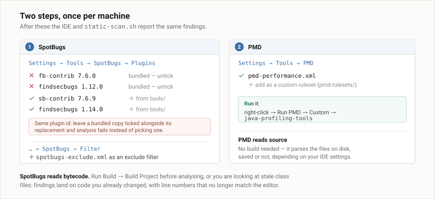
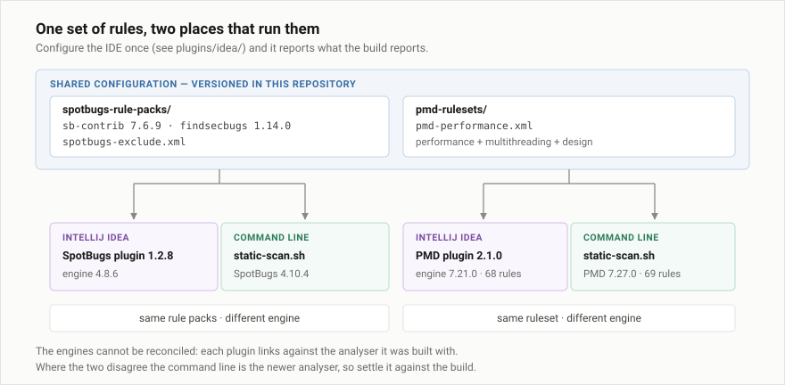

# `plugins/idea/` — IntelliJ IDEA eklentileri

**[English](README.md) · [Türkçe](README.tr.md)**

[`scripts/static-scan.sh`](../../scripts/static-scan.sh)'in çalıştırdığı iki
statik çözümleyici, internetsiz bir makinede kurulabilsin diye paketli. Aynı
analiz, editöre taşınmış hâli: sınıfa sağ tıklıyorsunuz, bulgular kodun içinde
çıkıyor.

| | [SpotBugs][sb] | [PMD][pmd] |
|---|---|---|
| Dosya | `spotbugs-idea-1.2.8.zip` | `PMDPlugin-2.1.0.zip` |
| Plugin id | `org.jetbrains.plugins.spotbugs` | `PMDPlugin` |
| Gereksinim | IDEA build `222.1`+ (2022.2'den itibaren) | IDEA build `241`+ (2024.1'den itibaren) |
| Neye bakıyor | **bytecode** | **kaynak** |
| İçindeki motor | SpotBugs 4.8.6 | PMD 7.21.0 |
| Ayar sayfası | `Settings → Tools → SpotBugs` | `Settings → Tools → PMD` |

[sb]: https://plugins.jetbrains.com/plugin/14014-spotbugs
[pmd]: https://plugins.jetbrains.com/plugin/1137-pmd

İkisi de Community veya Ultimate'te çalışıyor ve ikisi de 2025.2.x için
güncel — hiçbiri `until-build` bildirmiyor.

## Kurulum

`Settings → Plugins → ⚙ → Install Plugin from Disk…`, bir zip'i seçin, diğeri
için tekrarlayın, sonra **bir kez** yeniden başlatın. Marketplace'e hiçbir
bağlantı denenmiyor.

Ekip için, zip'leri iç ağdaki bir web sunucusundan `updatePlugins.xml` ile
sunmak yirmi kişinin tek tek diskten kurmasından iyidir — eklentiler o zaman
IDEA'nın normal arama ve güncelleme akışında görünür
(`Settings → Plugins → ⚙ → Manage Plugin Repositories → +`).

## SpotBugs bytecode okuyor, o yüzden önce derleyin

İnsanları en çok şaşırtan nokta bu. IDEA'nın kendi inspection'ları ve PMD siz
yazarken **kaynak** koda bakıyor. SpotBugs ise **derlenmiş bytecode**'a bakıyor
— metot sınırlarını aşarak veri akışını izliyor; kaynak seviyesindeki analizin
kaçırdığı null yollarını ve kapanmayan stream'leri bu yüzden bulabiliyor.

Yani: **analizden önce `Build → Build Project`.** Düzenleyip yeniden
derlemediğiniz bir sınıfı analiz etmek, eski bytecode üzerinden ve artık
tutmayan satır numaralarıyla bulgu üretir.

Sonra sınıfa veya pakete sağ tık → `SpotBugs → Analyze …`.

`Settings → Tools → SpotBugs` altında:

| Ayar | Değer | Neden |
|---|---|---|
| Effort | `Max` | Daha düşük değerler, SpotBugs'ı değerli kılan metotlar arası analizi atlıyor. |
| Minimum confidence | `Medium` | `Low`, bulgu sayısını kabaca üçe katlıyor. Buradan başlayın, rapor temizlenince `Low`'a inin. |
| Analysis effort on the fly | kapalı | Her tuş vuruşunda max efor, büyük bir modülde IDE'yi süründürür. |

Bir de exclude filtresi ekleyin — `Filter → Exclude filter files → +` ile
[`spotbugs-rule-packs/spotbugs-exclude.xml`](../../spotbugs-rule-packs/spotbugs-exclude.xml).
Filtre olmadan `EI_EXPOSE_REP` neredeyse her getter'da tetikleniyor ve rapor
kimsenin okumadığı binlerce bulguyla doluyor.

## IDE'nin build ile aynı kuralları çalıştırması

Kutudan çıktığı hâliyle ikisi farklı davranıyor; her eklenti için bunu
düzeltecek bir adım var.

### SpotBugs — yeni kural paketlerini devreye alın

Eklenti kural paketlerinin kendi kopyalarıyla geliyor ve bunlar
[`spotbugs-rule-packs/`](../../spotbugs-rule-packs/) içindekilerden **eski**:

| Eklentinin içindeki | Bu depodaki |
|---|---|
| `fb-contrib-7.6.0` (ve `6.2.1`) | `sb-contrib-7.6.9` |
| `findsecbugs-plugin-1.12.0` | `findsecbugs-plugin-1.14.0` |
| `AndroidFindbugs_0.5` | — |

`Settings → Tools → SpotBugs → Plugins → +` ile `sb-contrib-7.6.9.jar` ve
`findsecbugs-plugin-1.14.0.jar` dosyalarını diskten ekleyin **ve her birinin
gömülü kopyasını devre dışı bırakın.**

> Devre dışı bırakmak isteğe bağlı değil. SpotBugs aynı plugin id'sine sahip
> iki eklentiyi yüklemeyi reddediyor ve bu çiftler id'lerini paylaşıyor —
> `com.mebigfatguy.fbcontrib` ve `com.h3xstream.findsecbugs`. İkisi de açık
> kalırsa analiz, yenisini seçmek yerine tamamen başarısız oluyor.

Tersi yön — hiçbir şeyi kapatmak zorunda kalmamak için depoyu eklentinin
sürümlerine indirmek — işe yaramıyor. fb-contrib 7.6.0, SpotBugs 4.10.4'teki
bir BCEL değişikliğinden eski kalıyor ve üç dedektörü
(`IncorrectInternalClassUse`, `OverlyPermissiveMethod`,
`FunctionalInterfaceIssues`) rapor üretmek yerine her sınıfta hata fırlatıyor.
sb-contrib 7.6.9 bunu düzelten sürüm.

### PMD — paylaşılan ruleset'i gösterin

`Settings → Tools → PMD` altında
[`pmd-rulesets/pmd-performance.xml`](../../pmd-rulesets/pmd-performance.xml)
dosyasını özel ruleset olarak ekleyin. Sağ tık → `Run PMD → Custom →
java-profiling-tools` ile çalıştırın.

Bu, `static-scan.sh`'in CLI'ya verdiği dosyanın aynısı ve eklentinin PMD
7.21.0'ında da pakete dahil 7.27.0'da da aynı şekilde yüklenecek biçimde
yazıldı — 68'e karşı 69 kural, iki tarafta da sıfır yapılandırma hatası, aynı
bulgular. Ayrıntılar:
[`pmd-rulesets/README.tr.md`](../../pmd-rulesets/README.tr.md).

## Sonuçta nerede ne çalışıyor

Her iki adımdan sonra:

| | IDE | `static-scan.sh` |
|---|---|---|
| SpotBugs motoru | 4.8.6 | 4.10.4 |
| SpotBugs kural paketleri | **sb-contrib 7.6.9 + findsecbugs 1.14.0** | **aynısı** |
| PMD motoru | 7.21.0 | 7.27.0 |
| PMD ruleset | **pmd-performance.xml** | **aynısı** |

Kurallar aynı. Motorlar değil ve olamaz da: her eklenti, derlendiği
çözümleyici sürümüne bağlı ve bunu eklentinin içinde güvenle değiştirmek
mümkün değil. Pratikte fark küçük; ikisi çeliştiğinde daha yeni çözümleyici
CLI'daki — yani bir anlaşmazlık IDE'ye değil, **build**'e göre çözülmeli.

## IDE konfor, build otorite

İki aracı da build'inizde çalıştırın ve yeni bulgularda build'i kırın. IDE
eklentileri kod yazarken döndüğünüz döngü için; bir kalite kapısı değiller,
çünkü yalnızca birinin sağ tıklamayı hatırladığı yeri kapsıyorlar. CLI ve
Maven bağlantısı için bkz.
[`spotbugs-rule-packs/README.tr.md`](../../spotbugs-rule-packs/README.tr.md#build-içinde-kullanım).

## Bunlar ne değil

İki araç da *desen* buluyor. İkisi de hangisinin sıcak yolda olduğunu bilmiyor
ve başlangıçta bir kez çalışan bir `String` birleştirmesini 400 turluk
döngünün içindekiyle aynı vurguyla işaretliyor. Zamanın gerçekte nereye
gittiğini [`diagnose.sh`](../../scripts/diagnose.sh) ile bulun, sonra buraya
dönüp çözümleyicilerin o metot hakkında zaten söyleyecek bir şeyi var mıymış
diye bakın.

## Lisanslar

SpotBugs IDEA eklentisi, SpotBugs'ın kendisi gibi LGPL 2.1. PMD eklentisi, PMD
gibi BSD tarzı. Hiçbiri bu deponun [`LICENSE`](../../LICENSE) dosyası
kapsamında değil; şartları kendi arşivlerinin içinde geliyor.
